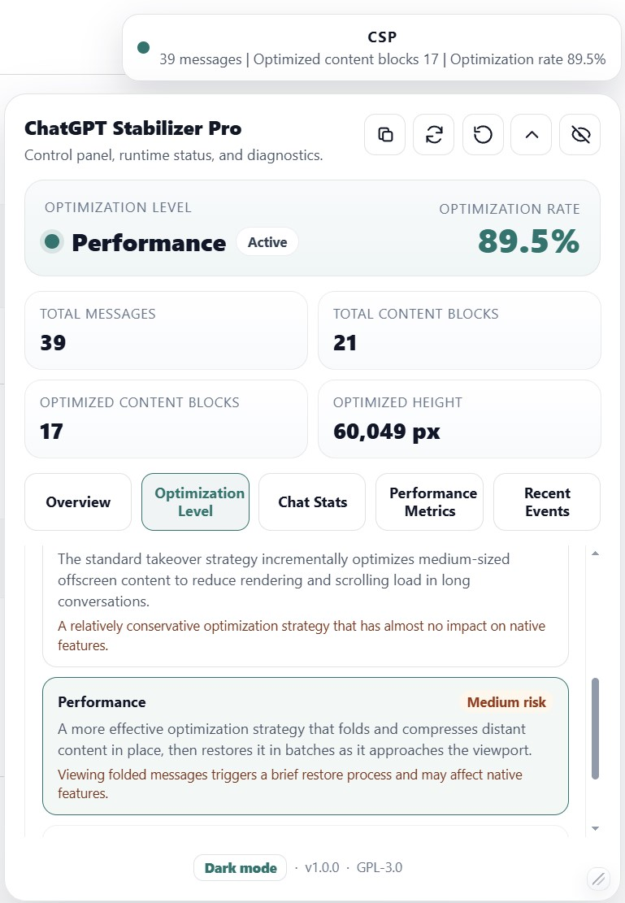
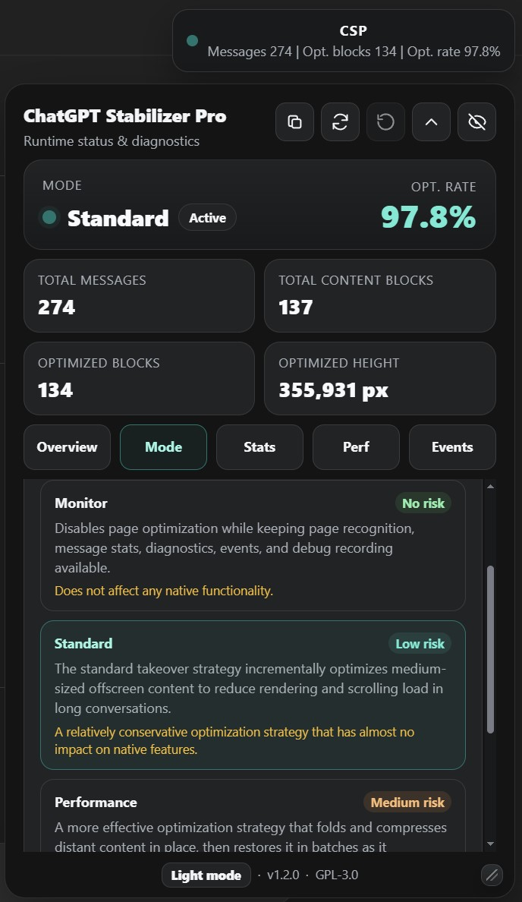

# ChatGPT Stabilizer Pro

  <a href="./README.md"><strong>中文</strong></a>

ChatGPT Stabilizer Pro is a stable, efficient, low-interference desktop browser extension for long ChatGPT conversations. It reduces scrolling lag, typing delay, and page stalls with multi-level optimization strategies while keeping ChatGPT's native page behavior as intact as possible.

## Screenshots

| Light mode | Dark mode |
| --- | --- |
|  |  |

## Features

- Recognizes both `chatgpt.com` and `chat.openai.com` by default.
- Offers four selectable modes: `Off`, `Monitor`, `Standard`, and `Performance`, plus a registered but not yet selectable planned mode: `Extreme`.
- Adds an in-page control panel for runtime status, optimization stats, diagnostics, and manual refresh.
- Supports local loading in desktop Chrome and Chromium-based browsers with Manifest V3.
- Supports temporary add-on loading in desktop Firefox.
- Currently supports English and Simplified Chinese. The extension loads the matching language pack based on your browser language.

## Local Installation

Download the latest `ChatGPT-Stabilizer-Pro-v*.zip` from GitHub Releases, then unzip it to a folder you can keep around. Local browser loading uses the unzipped folder, not the zip file itself.

### Chrome or Edge

1. Open `chrome://extensions/` or `edge://extensions/`.
2. Turn on `Developer mode`.
3. Click `Load unpacked`.
4. Select the unzipped extension folder. Its top level should contain `manifest.json`.
5. Open or refresh the ChatGPT page.

### Firefox

1. Open `about:debugging#/runtime/this-firefox`.
2. Click `Load Temporary Add-on`.
3. Select the `manifest.json` file inside the unzipped extension folder.
4. Open or refresh the ChatGPT page.

## Mobile

The current version does not officially support mobile browsers. It is mainly built for desktop browsers.

## Control Panel Buttons

- Copy: Copies the current panel information, useful when reporting an issue.
- Refresh: Manually resyncs the current page state.
- Restore current session: Clears optimization state for the current session and falls back to a safer mode if something unexpected happens.
- Collapse panel: Keeps only the compact panel visible.
- Hide panel: Hides both the full panel and compact panel, leaving only the small badge.

## Control Panel Tabs

The control panel includes several everyday tabs:

- Overview: Check runtime status, target mode, effective mode, optimization rate, and key stats.
- Optimization Level: Switch between `Off`, `Monitor`, `Standard`, `Performance`, and other modes, with a short note and risk hint for each one.
- Chat Stats: Check total messages, content block counts, observed content, optimizable content, optimized content, and the current visible range.
- Performance Metrics: Check initialization, sync, and resync timing, plus folding, restore, and blocking stats in `Performance` mode.
- Recent Events: Review recent extension events, and start debugging, stop debugging, copy logs, or export redacted debug JSON when troubleshooting.

## Optimization Modes

The extension provides several runtime modes. For normal use, start with `Standard`.

### Off

Disables all extension optimization, metrics, diagnostics, events, and debug recording. Only the control panel itself remains operable.

Useful when:

- You are checking whether a problem comes from the extension.
- You want ChatGPT to behave exactly like the original page.
- You need a clean comparison while testing page interactions.

### Monitor

Disables page optimization while keeping page recognition, message stats, diagnostics, recent events, and debug recording available.

Useful when:

- You want to check whether page recognition is working.
- You want message counts and diagnostics without changing page behavior.
- You need status data while keeping the page untouched.
- You want a no-optimization debug baseline.

### Standard

The recommended default.

It applies conservative optimization to content outside the current viewport. Copying, text selection, link clicks, editing, search, and other native page actions are designed to keep working normally.

Useful for:

- Most long conversations.
- Cases where stability matters more than pushing every last bit of performance.
- Pages with light to moderate scrolling lag.

### Performance

Performance-first mode.

It folds high-benefit history that is far away from the viewport, then restores it when that content gets close again. This mode can help more on extremely long conversations, but the first copy, selection, or click on folded history may need a short restore moment before it feels normal.

Useful for:

- Very long conversations.
- Pages packed with code blocks, tables, Markdown, images, or long text.
- Cases where `Standard` does not reduce enough lag.

Notes:

- Folded history stays in its original position. It is not deleted.
- Content restores automatically when it gets close to the viewport, or when you click, select, or focus it.

### Extreme

A planned mode that would be more aggressive than `Performance`. It is intended for the next version and is registered in the project, but not selectable yet.

## Recommended Use

For everyday use:

1. Start with `Standard`.
2. If the conversation still feels slow, switch to `Performance`.
3. If something looks wrong, switch to `Off` and compare.
4. If you only want status data or a no-optimization debug baseline, use `Monitor`.

When a long conversation is clearly dragging:

1. Open the control panel.
2. Switch to `Performance`.
3. Wait for the optimization status in the panel to settle.

## Permissions and Privacy

Full privacy policy: [PRIVACY.md](./PRIVACY.md#english-version).

This extension only requests the local `storage` permission. It does not send anything out on its own, and its content scripts only run on:

- `https://chat.openai.com/*`
- `https://chatgpt.com/*`

The extension reads the current ChatGPT page DOM to:

- Recognize the conversation structure.
- Count messages.
- Check whether content is outside the viewport.
- Measure content height.
- Estimate content complexity.
- Generate local diagnostics and debug logs.

Diagnostics snapshots and debug logs are only meant to help debug local page issues.
They are stored locally. While debugging is active, the panel and compact badge show a red warning-style active-debug state, and debug JSON cannot be copied or exported until debugging is stopped.
Debug logs use the `redacted` format by default. They do not export conversation text, page titles, raw URL paths, raw turn/message IDs, element `textContent`, `aria-label`, or `title` text.
Before posting diagnostics or debug logs publicly, still review them carefully because they may include key names, input lengths, structural summaries, local DOM identifiers, hashed correlation IDs, and other debugging context.

## Debug Logs

The `Recent Events` tab in the control panel includes debug logging. It records detailed page-structure changes so a problem can be tracked down instead of guessed at.

Keep in mind:

- Debugging is unavailable in `Off` mode.
- If you want a debug baseline without optimization takeover, use `Monitor`.
- While debugging is active, the panel and compact badge show a red warning-style active-debug state, then return to their normal state after debugging stops.
- JSON copy and export are disabled while debugging is active. Stop debugging first.
- If the debug log reaches its maximum entry limit, recording stops automatically and preserves the earliest entries instead of rolling over the beginning.

Debug logs can record:

- DOM event metadata such as clicks, input, focus, and selection.
- Limited input metadata such as key names, modifier keys, input type, and input length.
- ChatGPT page-structure change summaries.
- Extension sync, pipeline stage, fallback/recovery, and mode-decision events.
- Batched summaries of extension style writes.
- Redacted structural snapshots, diffs, and hashed correlation IDs.

When you run into an unexpected issue:

1. Open the control panel.
2. Go to the `Recent Events` tab.
3. Click `Start debugging`.
4. Reproduce the issue.
5. Click `Stop debugging`.
6. Export JSON or copy JSON manually.

Note: debug logs are exported as `schemaVersion: 2` JSON with `privacyMode: "redacted"`. They do not include conversation text or page-text summaries by default, but they may still include structured context, key names, and input lengths. Review the file before sending it to someone else.

## Reporting Issues

When reporting an issue, please include:

- Browser name and version.
- Operating system.
- Current ChatGPT domain.
- Current optimization mode.
- Exact steps that triggered the issue.
- The diagnostics snapshot from the control panel.
- Debug log JSON exported after debugging has stopped, if needed.

Before submitting diagnostics or debug logs, check them carefully for any context you do not want to make public.

The ChatGPT web app itself still has plenty of rough edges, so some problems may not come from this extension at all. If something breaks, first turn the extension fully off and try the same steps again. If the problem is still there with the extension off, it is more likely a ChatGPT-side issue that has to be fixed upstream.

## Project Structure

- `content/bootstrap/`: startup entry and namespace initialization.
- `content/core/`: configuration, i18n, logging, storage, diagnostics state, and shared utilities.
- `content/dom/`: ChatGPT page recognition, message discovery, layout measurement, observers, and interaction protection.
- `content/runtime/`: runtime scheduling, mode execution, performance metrics, fallback/recovery, and debug logging.
- `content/modes/`: optimization mode registry and mode implementations.
- `content/ui/`: control panel layout, rendering, subscriptions, and interaction handling.
- `content/style/`: base optimization styles and mode-specific styles.
- `icons/`: extension icons.
- `_locales/`: browser extension localization text.

## License

This project is released under the GPL-3.0-only license. See [LICENSE](LICENSE) for the full license text.
